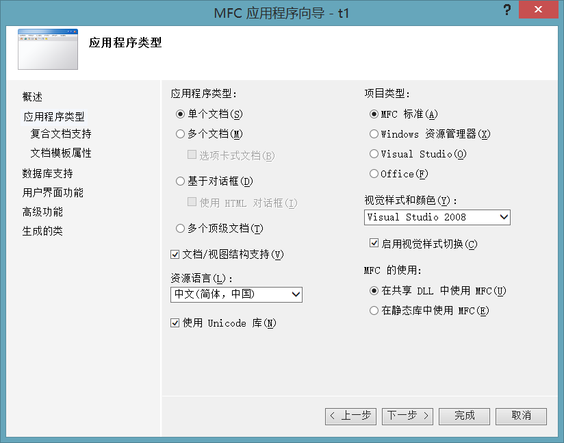

# 实验一：MFC绘图基础

## 实验目的

1. 掌握创建MFC项目的步骤
2. 掌握MFC图形输出的方法
3. 理解设备环境、画笔、画刷的概念，掌握常用的绘图函数

## 实验任务

1. 练习MFC基本绘图函数的使用

## 实验内容

### 一、新建MFC项目

以Visual Studio 2010为例，新建MFC项目的步骤如下：

#### 1. 选择 文件——新建——项目，打开项目新建对话框如下：


在上图的对话框中选择MFC应用程序，选择项目的存放位置，输入项目名称。点击下一步后进入创建项目向导。

#### 2. 在选择应用程序类型步骤中，选择应用程序类型是“单文档”，项目类型是“MFC标准”，其他选项保持默认。



#### 3. 向导中其他步骤的选项都保持默认，就可以创建一个MFC的项目。如下图所示：


此时点击运行按钮或者按F5执行程序，会弹出如下窗口：


### 二、MFC绘图方法

MFC中提供了设备环境类`CDC`（Device Context,设备环境），所有的绘图函数都在基类`CDC`中定义，它封装了全部的绘图操作。
作为绘图基础，本实验学习`CDC`类的基本绘图成员函数。

本门课程所有的绘制代码全部在`**View.cpp`文件中的`void  **View::OnDraw(CDC* pDC)`函数中实现。

#### 1. 常用的绘图数据类

`CPoint`（点）、`CSize`（大小）、`CRect`（矩形）是对Windows的`POINT`、`SIZE`和`RECT`结构的封装。

```c++
typedef struct tagPOINT{
LONG x;
LONG y;
}POINT,*PPOINT;

typedef struct tagSIZE{
int cx;
int cy;
}SIZE;

typedef struct tagRECT{
LONG left;
LONG top;
LONG right;
LONG bottom;
}RECT;
```

#### 2. 图形绘制

##### 1) 画点

绘制像素点是通过`CDC::SetPixel`和`CDC::SetPixelV`函数实现的，这两个函数都是用于在指定的坐标上设置指定的颜色，区别在于
`SetPixelV`函数不需要返回实际像素点的`RGB`值，因此使用`SetPixelV`函数进行绘制会快一些。

函数原型如下：

```c++
COLORREF SetPixel(int x,int y,COLORREF crColor)
COLORREF SetPixel(CPoint point,COLORREF crColor)
BOOL SetPixelV(int x,int y,COLORREF crColor)
BOOL SetPixelV(CPoint point,COLORREF crColor)
```

##### 2) 画线

配合使用`MoveTo()`和`LineTo()`函数可以绘制直线段或折线。
`MoveTo()`设置当前位置,函数原型：

```c++
CPoint MoveTo(int x,int y);
CPoint MoveTo(CPoint point);
```

`LineTo()`从当前位置开始绘制直线段,函数原型：

```c++
CPoint LineTo(int x,int y);
CPoint LineTo(CPoint point);
```

##### 3) 矩形

矩形是通过矩形的左上角和右下角的位置定义。绘制矩形的函数是`Rectangle`。

函数原型：

```c++
BOOL Rectangle(int x1,int y1,int x2,int y2);
BOOL Rectangle(CRect rect);
```

其中，`(x1,y1)`是矩形左上角坐标，`(x2,y2)`是矩形右下角坐标。

##### 4) 椭圆

椭圆是通过定义外接矩形的左上角和右下角的坐标来定义的。

函数原型：

```c++
BOOL Ellipse(int x1,int y1,int x2,int y2);
BOOL Ellipse (CRect rect);
```

#### 3. 画笔与画刷

##### 1) 创建画笔

画笔用于设置直线，曲线，或者区域的边界线的属性，一般包括线型，宽度和颜色三种属性。

创建画笔可以采用两种方法：

- 一种方法是通过调用画笔Cpen类的一个带参构造函数来构造一个Cpen类画笔对象。

    ```c++
    Cpen (int nPenStyle，int nWidth，COLORREF rgbColor)
    ```

    其中第一个参数用于指定画笔样式, 线型有实线，虚线，点线等7种风格，这些风格使用`PS_`为前缀的预定义标识，画笔的样式
    说明参考表2.1。第二个参数用于指定画笔宽度；第三个参数用于指定画笔颜色。画笔的颜色可以通过Windows提供的RGB宏来设置，
    其使用格式为：`RGB(nRed，nGreen，nBlue)`。
  
    参数`nRed`、`nGreen`、`nBlue`分别表示红、绿、蓝分量值，数值范围为0~255。如`RGB(0,0,0)`表示黑色、`RGB(255,0,0)`表示红色。

    **表2.1 画笔的样式说明**
    
    |       样式       |  说明  |
    |:--------------:|:----:|
    |    PS_SOLID    |  实线  |
    |     PS_DOT     |  点线  |
    |    PS_DASH     |  虚线  |
    |   PS_DASHDOT   | 点划线  |
    | PS_DASHDOTDOT  | 双点划线 |
    |    PS_NULL     | 空的边框 |
    | PS_INSIDEFRAME | 边框实验 |
    
    > [!TIP]
    > 注：各种虚线只有当线宽为1时才有效。
    > 
    > 例如：`CPen pen = CPen(PS_SOLID,3,RGB(0,255,0));`定义了一个宽3个像素绿色实线画笔。

- 创建画笔的另一个方法是首先声明一个`CPen`对象，然后调用`CPen`类的成员函数`CreatePen()`创建特定的画笔。

    ```c++
    CPen Pen;
    Pen.CretePen(int nPenStyle,int nWidth,COLORREF rgbColor);
    ```
    
    如下代码创建一个蓝色实线画笔：
    
    ```c++
    CPen PenNew;
    PenNew.CreatePen(PS_SOLID,1,RGB(0,0,255));
    ```
    
    当需要多次改变画笔的属性时，多采用这种方法。

##### 2) 选择创建的画笔到设备环境中

创建画笔后，必须调用成员函数`CDC::SelectObject()`将创建的画笔选入设备环境对象中。如果选择成功，函数`SelectObject()`
将返回原来画笔对象的指针。一般情况下，在选择新的画笔时应该保存原来的画笔对象，以备恢复。代码如下：

```c++
CPen *pPenOld;
pPenOld=pDC->SelectObject(&PenNew);
```

##### 3) 删除画笔

创建和选择画笔后，就可以使用该画笔对象进行绘图了。绘图完成后，为了及时释放内存资源，应该调用成员函数
`CDC：：SelectObject()`恢复以前保存的画笔对象；调用成员函数`CgdiObject::DeleteObject()`删除当前画笔对象。代码如下：

```c++
pDC->SelectObject(pPenOld);
PenNew.DeleteObject();
```

成员函数`DeleteObject()`用于删除底层的GDI对象，如果因为不慎，删除一个设备环境对象正在使用的GDI对象，将会引起应用程序的
运行异常。

##### 4) 创建画刷

画刷用于对图形内部进行填充。

画刷有三种基本类型：实体画刷、阴影画刷和图案画刷。创建画刷的一种方法是通过调用`CBrush`类三个不同的构造函数创建这三种类型
的画刷。

- 创建实体画刷：

    ```c++
    CBrush brush(RGBColor);
    ```
    
    此构造函数的参数指定实体画刷的颜色。
    
    例如创建一个红色画刷：`CBrush brush(RGB(255,0,0));`

- 创建阴影画刷：

    ```c++
    CBrush brush(BrushStyle,RGBColor);
    ```
    
    此构造函数的第一个参数指定画刷的样式，第二个参数指定颜色，
    
    例如：创建一个交叉的绿色阴影画刷：
    
    ```c++
    CBrush brush2(HS_CROSS,RGB(0,255,0));
    ```
    
    常见的成员函数有：

    - `CreateSolidBrush()`创建纯色画刷
    - `CreateHatchBrush()`创建阴影画刷

    下面代码同样创建一个交叉的绿色阴影画刷。
    
    ```c++
    CBrush BrushNew;
    BrushNew.CreateHatchBrush(HS_CROSS,RGB(0,255,0));
    ```

##### 5) 选择画刷

创建画刷后，同样必须调用成员函数`CDC::SelectObject()`将创建的画刷选入设备环境对象中，同时保存以前的画刷。

```c++
CBrush *pBrushOld;
pBrushOld=pDC->SelectObject(&BrushNew);
```

##### 6) 删除画刷

同样为了释放资源，在使用完成画刷对象后，也要及时删除画刷对象，恢复原来的画刷对象。


------------


## 练习

请编写程序完成下面的练习，并按要求给出代码和程序运行截图：   

1. 定义一支蓝色实线，宽度为3的画笔，绘制一条线段，起点，终点自由定义；

    ```c++
    CPen blue_3_solid_pen(PS_SOLID, 3, RGB(0, 0, 255));
    
    CPen red_1_dot_pen(PS_DOT, 1, RGB(255, 0, 0));
    
    CPen green_2_solid_pen(PS_SOLID, 2, RGB(0, 255, 0));
    CBrush blue_cross_brush(HS_DIAGCROSS, RGB(0, 0, 255));
    
    // line
    pDC->SelectObject(&blue_3_solid_pen);
    pDC->MoveTo(10, 10);
    pDC->LineTo(100, 100);
    
    blue_3_solid_pen.DeleteObject();
    ```
   
    

2. 定义一支红色点线，宽度为1的画笔，绘制一个正方形（大小自由定义），左上角在并用蓝色实体画刷填充图形内部；

    ```c++
    //squar
    pDC->SelectObject(&red_1_dot_pen);
    pDC->Rectangle(120, 10, 230, 110);

    red_1_dot_pen.DeleteObject();
    ```

   

3. 定义一支绿色实线，宽度为2的画笔，绘制一个圆，并用蓝色阴影画刷填充图形内部，阴影样式为HS_DIAGCROSS；

    ```c++
    // circle
    pDC->SelectObject(&green_2_solid_pen);
    pDC->SelectObject(&blue_cross_brush);
    pDC->Ellipse(240, 10, 340, 110);
    
    green_2_solid_pen.DeleteObject();
    blue_cross_brush.DeleteObject();
    ```

    

## 小结
了解了MFC的绘图基础及画笔、画刷的使用。