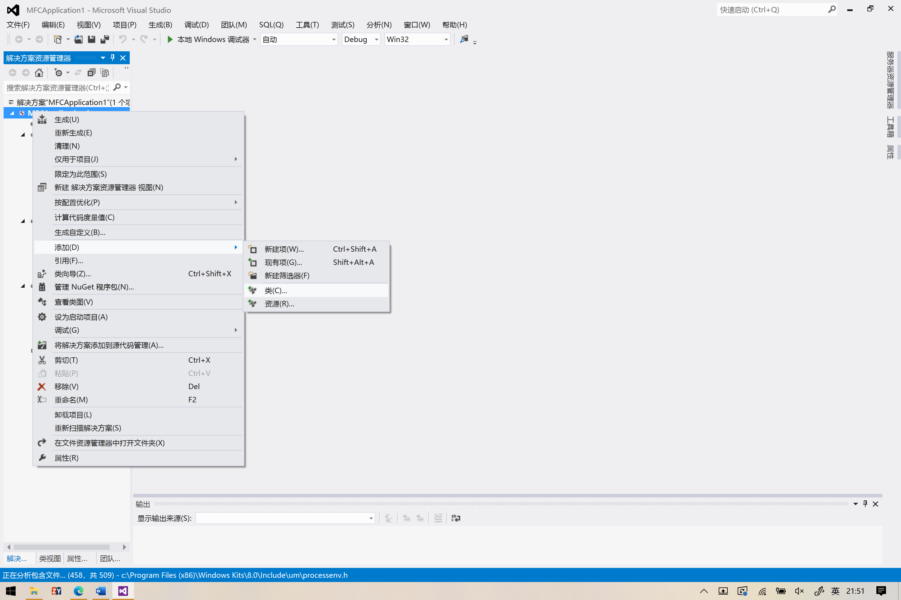
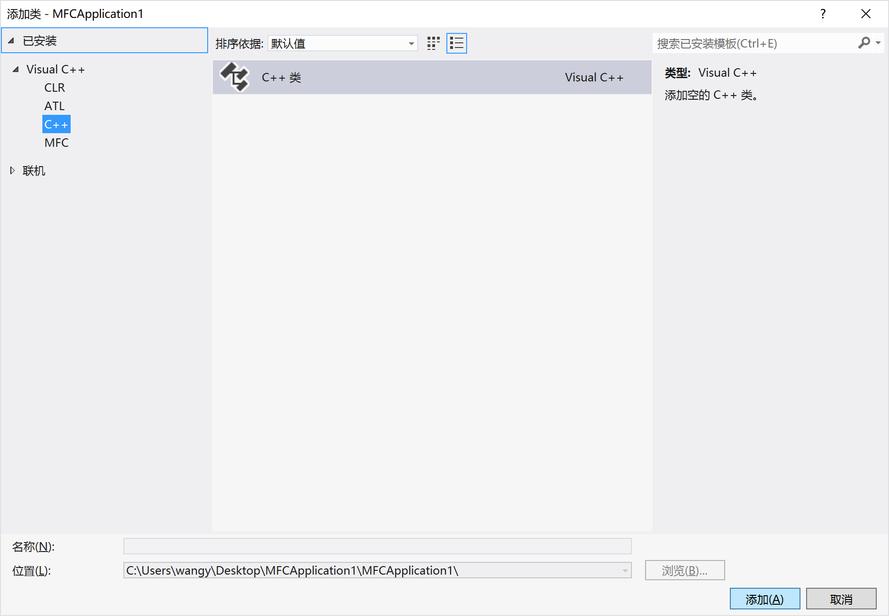
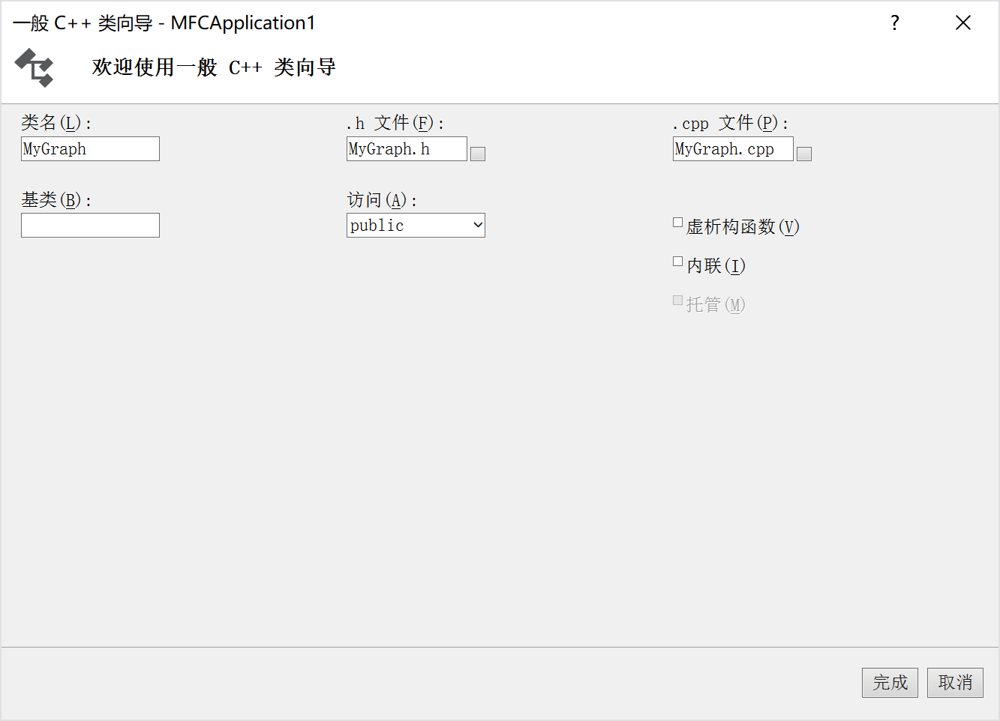
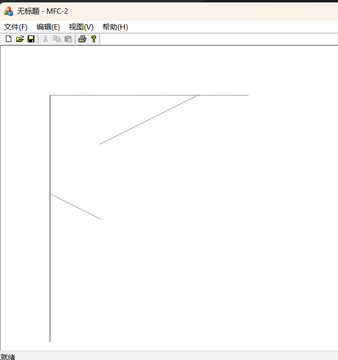
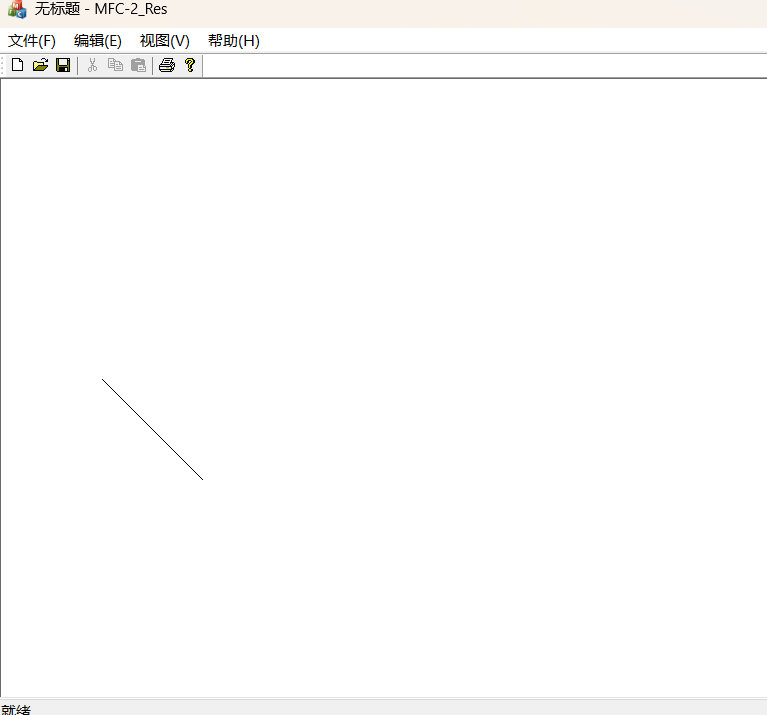
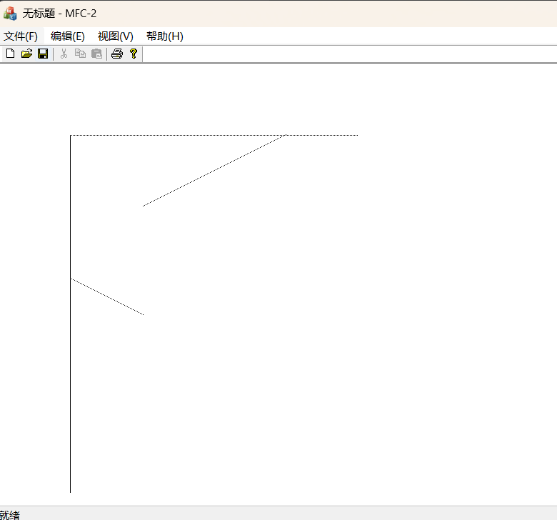

# 实验二：直线的扫描转换

## 实验目的

1. 理解什么是扫描转换
2. 掌握DDA直线扫描转换算法
3. 掌握Bresenham直线扫描转换算法

## 实验任务

练习直线扫描转换算法

## 实验内容

### MFC之如何进行C++类的创建

在接下来的实验中，我们将会创建一个图形库的类，在其中添加图形学的各类算法。MFC中创建C++类的步骤如下
（以Visual Studio 2012为例）：

1. 在解决方案资源管理器中，找到项目名称，点击右键，在弹出的菜单里选择“添加——类”

   

2. 在弹出的菜单里选择新建C++类

   

3. 在下一步的向导里输入类名，确定后创建成功

   

4. 接下来会生成自定义类名的头文件和源文件，在头文件中进行类的成员说明，在源文件中进行类的成员函数的定义。

### 一、DDA算法

算法原理：已知过端点 $(x_0,y_0)$ 、 $(x_1,y_1)$ 的直线段 $L:y=kx+b$ ,直线斜率为 $k=\frac{y_1-y_0}{x_1-x_0}$ 从
$x$ 的左端点开始， 向 $x$ 右端点步进, $步长=1(个像素)$ ， $y_i+1=y_i+k$ 。

即：当 $x$ 每递增1， $y$ 递增 $k$ （即直线斜率）。

### 二、Bresenham算法

算法原理：比较从理想直线到位于直线上方的像素的距离 $t$ 和相邻的位于直线下方的像素的距离 $s$ ，根据距离误差项的符号确定
与理想直线最近的像素。

整数化算法步骤：

$e$ 的初值为 $e_0=-\Delta x$ ，沿 $x$ 方向每递增一个单位，有 $e_{i+1}=e_i+2\Delta y$ 。当 $e_{i+1}\ge 0$ 时，下一像素选取
$(x_i+1,y_i+1)$ ，同时将 $e_{i-1}$ 更新为 $e_{i+1}-2\Delta x$ ；否则，下一像素选取 $(x_i+1,y_i)$ 。

当直线斜率 $0<K<1$ 时：

1. 画点 $(x_1,y_1)$ ， $\Delta x=x_2-x_1$， $\Delta y=y_2-y_1$ ， $e_0=-\Delta x$；
2. 计算 $e_i+1=e_i+2\Delta y$ ；
3. 计算直线的下一点位置： $x_i+1=x_i+1$ 。

   如果 $e\ge 0$ ，则 $y_i+1=y_i+1$ ，且 $e=e-2\Delta x$ ，否则 $y_i+1=y_i$ 。

4. 画点 $(x_i+1,y_i+1)$ ；
5. $i=i+1$，如果 $i\le \Delta x$ ，转去执行2，否则结束。


-------------


## 练习

请完成下面的程序：

1. 使用DDA算法实现直线的生成，考虑任意斜率的直线。测试下面直线的绘制：


$$(100,300)\leftrightarrow (100,600)$$
$$(100,400)\leftrightarrow (100,100)$$
$$(300,100)\leftrightarrow (500,100)$$
$$(400,100)\leftrightarrow (100,100)$$
$$(200,200)\leftrightarrow (400,100)$$
$$(200,300)\leftrightarrow (100,200)$$

   ```c++
   void DDA_Line::DrawLine(CPoint start, CPoint end, COLORREF color)
   {
       const int dx = end.x - start.x;
       const int dy = end.y - start.y;
   
       if (dx == 0 || abs(dy / dx) > 1)
       {
           if (start.y > end.y)
           {
               // 交换两数
               start.y = start.y ^ end.y;
               end.y = start.y ^ end.y;
               start.y = start.y ^ end.y;
           }
           
           int x = start.x;
           int y = start.y;
           const double K = dx ? 1.0 * dy / dx : 0;
           const int x_offset = (K > 0) - (K < 0);	// K > 0, 1; K == 0, 0; K < 0, -1;
           
           while (y <= end.y)
           {
               this->pDC->SetPixel(x += x_offset * this->step, y++, color);
           }
   
       } else
       {
           if (start.x > end.x)
           {
               // 交换两数
               start.x = start.x ^ end.x;
               end.x = start.x ^ end.x;
               start.x = start.x ^ end.x;
           }
           
           int x = start.x;
           int y = start.y;
           const double K = 1.0 * dy / dx;
           const int y_offset = (K > 0) - (K < 0);	// K > 0, 1; K == 0, 0; K < 0, -1;
           
   
           while (x <= end.x)
           {
               this->pDC->SetPixel(x += this->step, y += y_offset, color);
           }
       }
   ```

   

2. 使用Bresenham算法实现斜率 $0 < k < 1$ 的直线的生成

   ```c++
   void Bresenham::DrawLine(CPoint start, CPoint end, COLORREF color)
   {
   
       const int dx = end.x - start.x;
       const int dy = end.y - start.y;
   
        if (start.x > end.x)
        {
            // 交换两数
            start.x = start.x ^ end.x;
            end.x = start.x ^ end.x;
            start.x = start.x ^ end.x;
        }
        
        int x = start.x;
        int y = start.y;
        const double K =  1.0 * dy / dx;
        double e = -0.5;
   
        while (x <= end.x)
        {
            if (e >= 0)
            {
                y += K < 0 ? -1 : 1;
                e += fabs(K) - 1;
            } else
            {
                e += fabs(K);
            }
   
            x++;
            this->pDC->SetPixel(x, y, color);
        }   
   }
   ```
   
   

3. **扩展题***选做：实现任意斜率直线Bresenham扫描转换算法。

   ```c++
   void Bresenham::DrawLine(CPoint start, CPoint end, COLORREF color)
   {
   
       const int dx = end.x - start.x;
       const int dy = end.y - start.y;
   
       if (dx == 0 || abs(dy / dx) > 1)
       {
           if (start.y > end.y)
           {
               // 交换两数
               start.y = start.y ^ end.y;
               end.y = start.y ^ end.y;
               start.y = start.y ^ end.y;
           }
           
           int x = start.x;
           int y = start.y;
           double K = dx ? 1.0 * dy / dx : 0;
           double e = -0.5;
           
           while (y <= end.y)
           {
               if (e >= 0)
               {
                   x += K < 0 ? -1 : 1;
                   e += fabs(K) - 1;
               } else
               {
                   e += fabs(K);
               }
               
               y++;
               this->pDC->SetPixel(x, y, color);
               
           }
       } else
       {
           if (start.x > end.x)
           {
               // 交换两数
               start.x = start.x ^ end.x;
               end.x = start.x ^ end.x;
               start.x = start.x ^ end.x;
           }
           
           int x = start.x;
           int y = start.y;
           const double K =  1.0 * dy / dx;
           double e = -0.5;
   
           while (x <= end.x)
           {
               if (e >= 0)
               {
                   y += K < 0 ? -1 : 1;
                   e += fabs(K) - 1;
               } else
               {
                   e += fabs(K);
               }
   
               x++;
               this->pDC->SetPixel(x, y, color);
           }   
       }
   }
   ```
   
   

## 小结

理解扫描转换的基本概念，掌握DDA直线扫描转换算法与Bresenham直线扫描转换算法。

