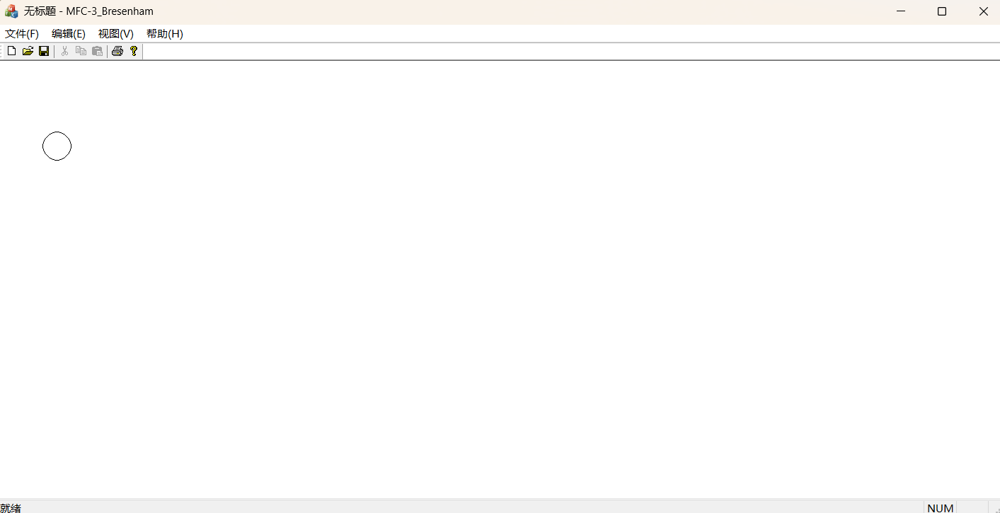
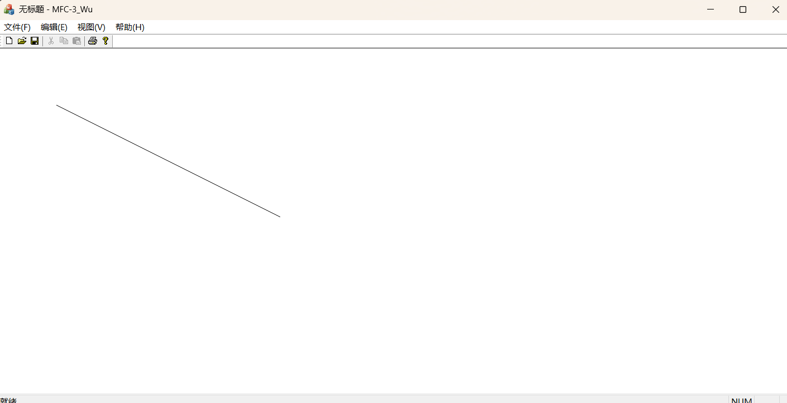
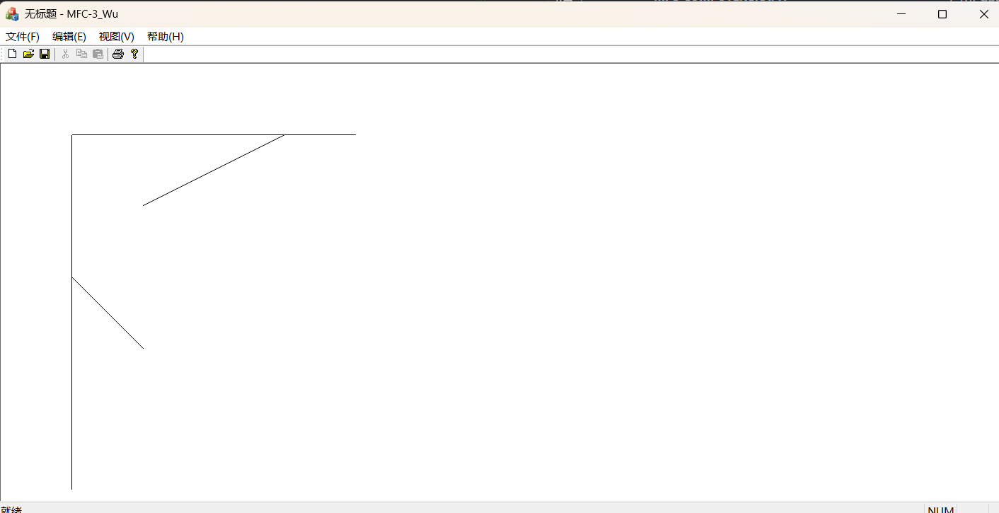

# 实验三：圆的扫描转换与反走样

## 实验目的

1. 理解什么是扫描转换
2. 掌握中点画圆换算法
3. 掌握wu直线反走样算法


## 实验任务

练习圆的扫描转换算法，反走样算法。

## 实验内容

### 一、Bresenham圆扫描转换

**圆的八对称性：**

根据圆的对称性，可以用四条对称轴 $x=0$ 、 $y=0$ 、 $x=y$ 、 $x=-y$ 将圆分成8等份。只要绘制出第一象限内的 $\frac{1}{8}$ 
圆弧，根据对称性就可绘制出整圆，这称为八分法画圆算法。假定第一象限内的任意点为 $P(x,y)$ ，可以顺时针确定另外7个点：
$P(y,x)$ 、 $P(-y,x)$ 、 $P(x,-y)$ 、 $P(-x,-y)$ 、 $P(-y,-x)$ 、 $P(y,-x)$ 、 $P(-x,y)$ 。

绘制第一象限内的 $\frac{1}{8}$ 圆弧的算法如下：

1. 初始化， $x=0$ 、 $y=r$ 、 $d=1.25-r$ ；
2. 当 $x_i<y_i$ 时，执行以下操作：

   1. 画像素点 $(x_i,y_i)$ ；
   2. 求下一个像素点：

$$
x_{i+1}=x_i+1
$$

$$
y_{i+1}=

\left\{
   \begin{matrix}
      y_i, & d_i < 0 \\
      y_i - 1, & d_i \ge 0
   \end{matrix}
\right.
$$

   3. 求下一步的误差：

$$
d_{i+1}=

\left\{
   \begin{matrix}
      d_i + 2x_i + 3, & d_i < 0 \\
      d_i + 2(x_i - y_i) + 5, & d_i \ge 0
   \end{matrix}
\right.
$$

3. 若 $x_i = y_i$ ，画像素点 $(x,y)$ ；否则重复第二步。

## 二、wu反走样

Wu反走样算法原理是对于理想直线上的任一点，同时以两个不同亮度级别的相邻像素来表示。

算法步骤：

1. 初始化 $x=x_0$ ， $y=y_0$ ， $e=k$
2. 绘制 $(x,y)$ 、 $(x,y+1)$ ，同时计算两个像素点的颜色：

   ```c++
   pDC->SetPixelV(p.x, p.y, RGB(e * 255, e * 255, e * 255));
   pDC->SetPixelV(p.x, p.y+1, RGB((1 - e) * 255, (1 - e) * 255, (1 - e) * 255));
   ```

3. 进行如下操作：

   ```c++
   if (e < 1) {
      x++;
      e += k;
   } else if (e >= 1) {
      x++;
      y++;
      e += k;
      e--;
   }
   ```

## 练习

1. 使用Bresenham圆扫描转换算法，完成圆心在 $(100,100)$ ，半径是20的圆的绘制。

   ```c++
   void Bresenham_Circle::Draw(COLORREF color)
   {
      int offset_x = center.x - r;
      int offset_y = center.y + r;
      while (x < y)
      {
         pDC->SetPixel(x + offset_x, y + offset_y, color);
         pDC->SetPixel(y + offset_x, x + offset_y, color);
         pDC->SetPixel(-y + offset_x, x + offset_y, color);
         pDC->SetPixel(x + offset_x, -y + offset_y, color);
         pDC->SetPixel(-x + offset_x, -y + offset_y, color);
         pDC->SetPixel(-y + offset_x, -x + offset_y, color);
         pDC->SetPixel(y + offset_x, -x + offset_y, color);
         pDC->SetPixel(-x + offset_x, y + offset_y, color);
      
         x++;
         y = d < 0 ? y : y - 1;
         
         d = d < 0 ? (d + 2 * x + 3) : d + 2 * (x - y) + 5;
      }
   }
   ```

   

2. 使用Wu反走样算法扫描转换起点在 $(100，100)$ 终点在 $(500,300)$ 的直线。

   ```c++
   void Wu::Draw(COLORREF color)
   {
      const int dx = end.x - start.x;
      const int dy = end.y - start.y;

      if (start.x > end.x)
      {
         // 交换两数
         start.x = start.x ^ end.x;
         end.x = start.x ^ end.x;
         start.x = start.x ^ end.x;
      }
      
      int x = start.x;
      int y = start.y;
      const double K =  1.0 * dy / dx;
      double e = K;

      while (x <= end.x)
      {
         x++;
         const int y_offset = K < 0 ? -1 : 1;

         if (e >= 1)
         {
               
               y += y_offset;
               e += fabs(K) - 1;

               pDC->SetPixelV(x, y, RGB((2 - e) * 255, (2 - e) * 255, (2 - e) * 255));
               pDC->SetPixelV(x, y + y_offset, RGB((e - 1) * 255,(e - 1) * 255,(e - 1) * 255));
         } else
         {
               e += fabs(K);

               pDC->SetPixelV(x, y, RGB(e * 255,e * 255,e * 255));
               pDC->SetPixelV(x, y + y_offset, RGB((1 - e) * 255, (1 - e) * 255, (1 - e) * 255));
         }
      }   
   }
   ```

   

3. *实现任意斜率的wu反走样算法。

   ```c++
   void Wu::Draw(COLORREF color)
   {
      const int dx = end.x - start.x;
      const int dy = end.y - start.y;

      if (dx == 0 || abs(dy / dx) > 1)
      {
         if (start.y > end.y)
         {
               // 交换两数
               start.y = start.y ^ end.y;
               end.y = start.y ^ end.y;
               start.y = start.y ^ end.y;
         }
         
         int x = start.x;
         int y = start.y;
         double K = end.x - start.x ? 1.0 * dy / dx : 0;
         double e = fabs(K);
         
         while (y <= end.y)
         {
               y++;
               const int x_offset = K < 0 ? -1 : 1;
               
               if (e >= 1)
               {
                  
                  x += x_offset;
                  e += fabs(K) - 1;

                  pDC->SetPixelV(x , y, RGB((2 - e) * 255, (2 - e) * 255, (2 - e) * 255));
                  pDC->SetPixelV(x + x_offset, y, RGB((e - 1) * 255,(e - 1) * 255,(e - 1) * 255));
               } else
               {
                  e += fabs(K);

                  pDC->SetPixelV(x, y, RGB(e * 255,e * 255,e * 255));
                  pDC->SetPixelV(x + x_offset, y, RGB((1 - e) * 255, (1 - e) * 255, (1 - e) * 255));
               }
         }
      } else
      {
         if (start.x > end.x)
         {
               // 交换两数
               start.x = start.x ^ end.x;
               end.x = start.x ^ end.x;
               start.x = start.x ^ end.x;
         }
         
         int x = start.x;
         int y = start.y;
         const double K =  1.0 * dy / dx;
         double e = K;

         while (x <= end.x)
         {
               x++;
               const int y_offset = K < 0 ? -1 : 1;
      
               if (e >= 1)
               {
                  
                  y += y_offset;
                  e += fabs(K) - 1;

                  pDC->SetPixelV(x, y, RGB((2 - e) * 255, (2 - e) * 255, (2 - e) * 255));
                  pDC->SetPixelV(x, y + y_offset, RGB((e - 1) * 255,(e - 1) * 255,(e - 1) * 255));
               } else
               {
                  e += fabs(K);

                  pDC->SetPixelV(x, y, RGB(e * 255,e * 255,e * 255));
                  pDC->SetPixelV(x, y + y_offset, RGB((1 - e) * 255, (1 - e) * 255, (1 - e) * 255));
               }
         }   
      }
   }
   ```

   

## 小结

理解了什么是扫描转换并掌握了中点画圆换算法和wu直线反走样算法。
