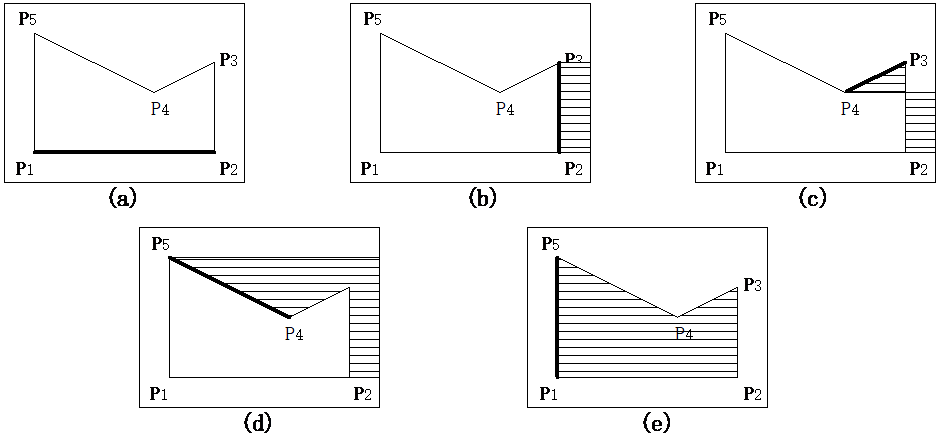
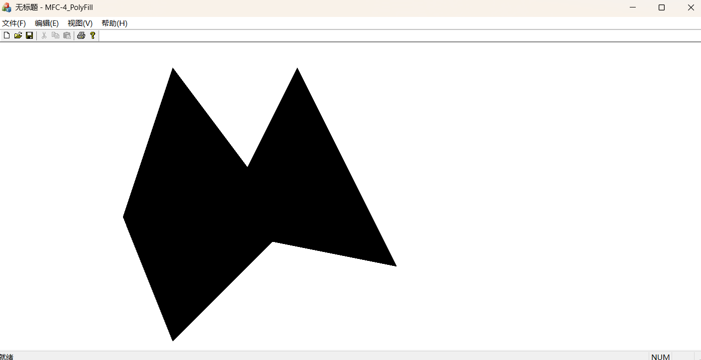

# 实验四：多边形的扫描转换

## 实验目的

1. 理解多边形的定义，多边形在计算机中的表示
2. 掌握顶点表示的多边形的扫描转换算法
3. 掌握有效边表的填充算法
4. 掌握边缘填充算法

## 实验任务

练习顶点表示的多边形的填充

## 实验内容

### 一、阅读并理解多边形有效边表填充算法。

### 二、编写程序实现以边为中心的边缘填充算法

算法的原理是将每条非水平边右侧的像素取补，边的处理顺序随意。像素点颜色值经过偶数次取补运算后保持不变，经过奇数次取补运
算后变为其补数。



算法流程：

1. 已知要绘制的多边形的顶点顺序
2. 找出所有顶点中最大的 $x$ 值`xmax`，作为求补时候最右侧的终点
3. 循环处理每一条边
   1. 求出当前边的斜率倒数`m`
   2. 求解当前边的最大的 $y$ 值`ymax`和最小的 $y$ 值`ymin`，以及最小的 $y$ 值对应的 $x$ 值`xmin`
   3. 对当前边的右边所有像素取反操作:
   
       从`ymin`到`ymax`循环，每次步进1个像素 
       将当前的`xmin`到`xmax`之间的像素全部取补
       `xmin`加上`m`

## 练习

请完成下面的程序：

1. 已知多边形的顶点序列： $(550,400)$ 、 $(350,600)$ 、 $(250,350)$ 、 $(350,50)$ 、 $(500,250)$ 、 $(600,50)$ 、
$(800,450)$ ，使用以边为中心的边缘填充算法实现多边形的填充。

    ```c++
    void EdgePolyFill::Draw(CPoint* poly, int point_num, int step)
    {
        int x_end = poly[0].x;
        for (int i = 0; i < point_num; i++)
        {
            x_end = std::max<INT>(poly[i].x, x_end);
        }
    
        for (int i = 1; i < point_num; i++)
        {
            CPoint p_max = poly[i].y > poly[i - 1].y ? poly[i] : poly[i - 1];
            CPoint p_min =  poly[i].y < poly[i - 1].y ? poly[i] : poly[i - 1];
            const double m = p_min.y != p_max.y ? 1.0 * (p_min.x - p_max.x) / (p_min.y - p_max.y) : 0;
            double x_actual = p_min.x;
            
            for (int y = p_min.y; y < p_max.y; y++)
            {
                for (int x = p_min.x; x <= x_end; x++)
                    draw_negative_point(x, y);
    
                // 防止误差过大，写时转int，而非每次累加直接转换为int。
                x_actual += y % step == 0 ? m * step : 0;
                p_min.x = static_cast<int>(x_actual);
            }
        }
    }
    ```
   
    

## 小结

理解了多边形的定义及多边形在计算机中的表示方式；掌握了顶点表示的多边形的扫描转换算法；掌握了边缘填充算法。

