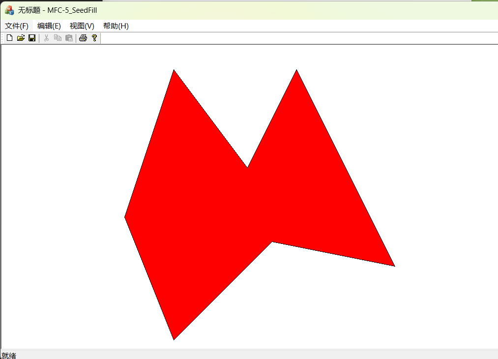

# 实验五：种子填充算法

## 实验目的

1. 理解多边形的定义，多边形在计算机中的表示
2. 理解多边形填充的目的
3. 掌握点阵表示的多边形的填充

## 实验任务

练习种子填充算法

## 实验内容

### 一、编写程序实现四连通种子填充算法

#### 算法原理

- 算法的输入：种子点坐标 $(x,y)$ ，要填充的颜色
- 以种子点为起点，查看它是否是边界（根据颜色）或者是否已经被填充。
- 如果是，则返回，否则填充该像素，并用一个邻接的像素作为新的种子进行递归。

#### 算法步骤

1. 种子像素压入栈中；
2. 如果栈为空，则转5；否则转3；
3. 弹出一个像素，并将该像素置成填充色；并判断该像素相邻的四连通像素是否为边界色或已经置成多边形的填充色，若不是，则将该像素压入栈；
4. 转2；
5. 结束。

#### 实现步骤

1. 在项目名称上右键-添加-类，输入类名`stack_node`，新建一个栈元素结构类，类里的成员包括：

```c++
CPoint PixelPoint;
Stack_node *Next;
```

2. 在`图形类.h`文件中添加`#include "stack_node.h"`
3. 在图形类中（`图形类.h`文件）添加数据成员

```c++
Stack_node *Head,*Base,*Last;//结点指针
```

4. 在图形类中（`图形类.h`文件）添加成员函数

```c++
void PolygonFill(CDC *pDC,CPoint *p,int n,CPoint seed,COLORREF ec,COLORREF fc);//区域填充，参数2表示 顶点数组，参数3表示顶点个数，参数3表示种子点，参数4表示边界色，参数5表示填充色
void Push(CPoint point);//入栈
Stack_node *Pop();//出栈
```

5. 在图形类的构造函数（`图形类.cpp`文件）中进行数据成员的初始化

```c++
Head = Last = NULL;
```

6. 在`图形类.cpp`文件中实现入栈和出栈的成员函数

```c++
void xxView::Push(CPoint point)//入栈函数
{
	Base=new Stack_node;
	Base->PixelPoint=point;
	Base->Next=NULL;
	if(Head==NULL)//空链
	{
		Last = Head = Base;
	}
	else
	  {
		  Last->Next=Base;
		  Last = Base;
	}
}

Stack_node * xxView::Pop()//出栈函数
{
	//弹出栈顶元素
	Stack_node *t;
	Base=Head;
	if(Base->Next==NULL)
	{
		Head=NULL;
		return Base;
	}
	while(Base->Next!=NULL)
	{
		Base=Base->Next;
		if(Base->Next==Last) 
		{
			Base->Next=NULL;
			t = Last;
			Last = Base;
			return t;
		}
	}
	return NULL;
}
```

-------

## 作业

1. 完成四连通种子填充函数`PolygonFill(CDC *pDC,CPoint *p,int n,CPoint seed,COLORREF ec,COLORREF fc)`。

    提示：填充之前用边界颜色线条绘制出多边形。

    ```c++
    void CMFC5SeedFillView::PolygonFill(CDC* pDC, CPoint* p, int n, CPoint seed, COLORREF ec, COLORREF fc)
    {
        CPen pen(PS_SOLID, 1, ec);
        pDC->SelectObject(&pen);
        
        for (int i = 1; i < n; i++)
        {
            pDC->MoveTo(p[i - 1].x, p[i - 1].y);
            pDC->LineTo(p[i].x, p[i].y);
        }
    
        pen.DeleteObject();
    
        this->Push(seed);
    
        Stack_node* element;
        while ((element = this->Pop()) != NULL)
        {
            CPoint point = element->PixelPoint;
    
            if (pDC->GetPixel(point) == fc)
                break;
            
            pDC->SetPixel(point, fc);
    
            CPoint neighbor_points[] = {
                CPoint(point.x - 1, point.y),
                CPoint(point.x, point.y - 1),
                CPoint(point.x, point.y + 1),
                CPoint(point.x + 1, point.y)
            };
    
            for each (CPoint i in neighbor_points)
            {
                if (pDC->GetPixel(i) != ec && pDC->GetPixel(i) != fc)
                    this->Push(i);
            }
        }
    }
    ```

    

## 小结

理解了多边形的定义与多边形在计算机中的表示，并掌握了点阵表示的多边形的填充及种子填充算法。


