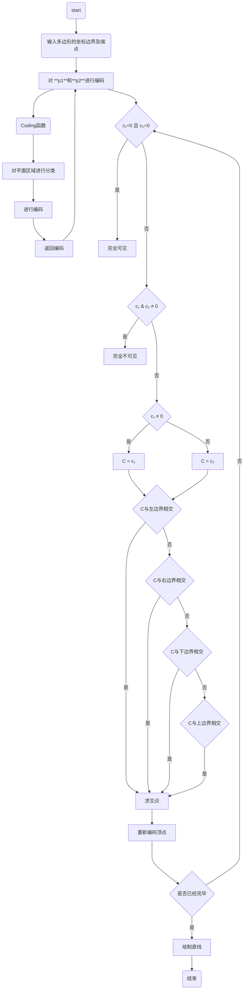
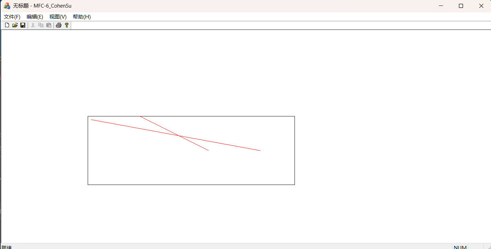

# 实验六：直线裁剪算法

## 实验目的

1. 理解裁剪的作用
2. 掌握直线裁剪的算法

## 实验任务

Cohen Sutherland裁剪算法

## 实验内容

### Cohen Sutherland裁剪算法

#### 算法原理

首先判断直线段是否全部在窗口内，是，则保留；不是，则再判断是否完全在窗口之外，如是，则舍弃。

如果这两种情况都不属于，则将此直线段从交点处分割，对分割后的线段再进行如前判断。

直至所有直线段和由直线段分割出来的子线段都已经确定了是保留还是舍弃为止。

#### 算法流程

> [!NOTE]
>
> 注意：`l`为`left`，`r`为`right`，`b`为`bottom`，`t`为`top`

1. 对直线的两个端点进行编码

    编码方式：

    - 若 $x$ 小于`wxl`（`window_x_left`）， $D_0=1$ ，否则 $D_0=0$ ，即 $C_1 \vee 0001$ ；
    - 若 $x$ 大于 `wxr`（`window_x_right`）， $D_1=1$ ，否则 $D_1=0$ ，即 $C_1 \vee 0010$ ；
    - 若 $y$ 小于`wyb`（`window_y_bottom`）， $D_2=1$ ，否则 $D_2=0$ ，即 $C_1 \vee 0100$ ；
    - 若 $y$ 大于`wyt`（`window_y_top`）， $D_3=1$ ，否则 $D_3=0$ ，即 $C_1 \vee 1000$ 。

```math
\begin{array}{c:c:c}
    1001 & 1000 & 1010 \\
    \hdashline
    0001 & 0000 & 0010 \\
    \hdashline
    0101 & 0100 & 0110
\end{array}
```

2. 进行区域测试

    - 如果`code1`和`code2`均为0，`code1`按位或`code2`，则说明`P1`和`P2`均在窗口内，那么线段全部位于窗口内部，应取之。
    - 如果`code1`和`code2`经过按位与运算后的结果`code1 & code2`不等于0，说明`P1`和`P2`同时在窗口的上方、下方、左方或右方，那么线段全部位于窗口的外部，应弃之。

3. 当2不满足时，确保`P1`在窗口外部：若`P1`在窗口内，则交换`P1`和`P2`的坐标值和编码。

4. 求出直线段与窗口边界的交点，并用该交点的坐标值替换`P1`的坐标值。也即在交点`S`处把线段一分为二。考虑到`P1`是窗口外的一点，因此可以去掉直线`P1-S`，即：

    - 若 $C_1 \wedge 0001 \ne 0$ ，则 $x=x_{min}$ 。代入直线方程，求出 $y$ 交点；
    - 若 $C_1 \wedge 0010 \ne 0$ ，则 $x=x_{max}$ 。代入直线方程，求出 $y$ 交点；
    - 若 $C_1 \wedge 0100 \ne 0$ ，则 $y=y_{min}$ 。代入直线方程，求出 $x$ 交点；
    - 若 $C_1 \wedge 1000 \ne 0$ ，则 $y=y_{max}$ 。代入直线方程，求出 $x$ 交点。

5. 画出当前的直线段`P1-P2`。
6. 算法结束。



## 作业

1. 假设裁剪窗口参数为`wxl=250`、`wxr=850`、`wyb=450`、`wyt=250`。其中，`wxl`为左侧裁剪边，`wxr`为右侧裁剪边，`wyb`为下侧裁剪边，`wyt`为上裁剪边。编写`unsigned int EnCode(double,double);`函数，实现对直线端点的编码。

> [!TIP]
>
> 提示：编码的代码实现区域编码思路：如,端点在裁剪窗口左侧，其编码最后一位为1，可以按位或0001，将编码最后一位至1。

    ```c++
    unsigned int CohenSu::EnCode(double x, double y)
    {
        return (x < this->window_x_left) |
            (x > this->window_x_right) << 1 |
            (y > this->window_y_bottom) << 2 |
            (y < this->window_y_top) << 3;
    }
    ```

2. 写出裁剪函数`CohenSutherland()`，并在`OnDraw()`里面绘制出裁剪窗口，绘制出裁剪后的直线，测试裁剪结果是否正确，给出至少三种情况的直线的裁剪，第一种情况，全部保留，第二种情况，完全去除，第三种情况，直线需要剪切。

    ```c++
    void CohenSu::CohenSutherland(CPoint start, CPoint end)
    {
        unsigned int start_code = this->EnCode(start.x, start.y);
        unsigned int end_code = this->EnCode(end.x, end.y);
        
        if (start_code & end_code) return;
        
        if (!(start_code | end_code))
        {
            CPen* pPen = new CPen(PS_SOLID, 1, this->line_color);
            this->pDC->SelectObject(pPen);
            this->pDC->MoveTo(start);
            this->pDC->LineTo(end);
            pPen->DeleteObject();
            return;
        }
        
        if (start_code == 0b0000)
        {
            std::swap(start, end);
            std::swap(start_code, end_code);
        }
        
        const double K = end.x != start.x ? 1.0 * (end.y - start.y) / (end.x - start.x) : 0.0;
        const double B = start.y - K * start.x;

        int intersection_x;
        int intersection_y;

        if (start_code & 0b0011)
        {
            intersection_x = (start_code & 0b0001) ? this->window_x_left : this->window_x_right;
            intersection_y = K * intersection_x + B;
        } else
        {
            intersection_y = (start_code & 0b0100) ? this->window_y_bottom : this->window_y_top;
            intersection_x = 1.0 * (intersection_y - B) / K;
        }

        CPoint intersection_point = CPoint(intersection_x, intersection_y);
        this->CohenSutherland(intersection_point, end);
    }

    void CohenSu::OnDraw()
    {
        CPen* pPen = new CPen(PS_SOLID, 1, this->window_color);
        this->pDC->SelectObject(pPen);
        this->pDC->Rectangle(this->window_x_left,
                            this->window_y_top,
                            this->window_x_right,
                            this->window_y_bottom);

        pPen->DeleteObject();
    }
    ```

    

## 小结

理解了裁剪的作用与直线裁剪的算法。
