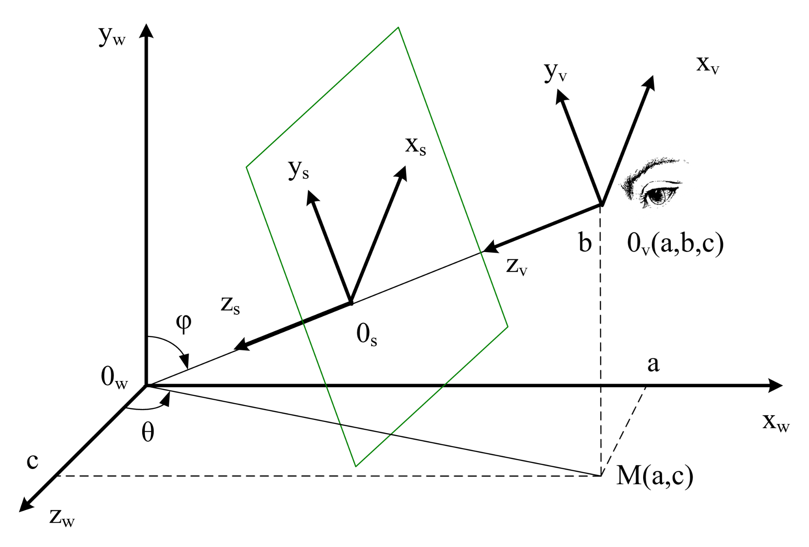
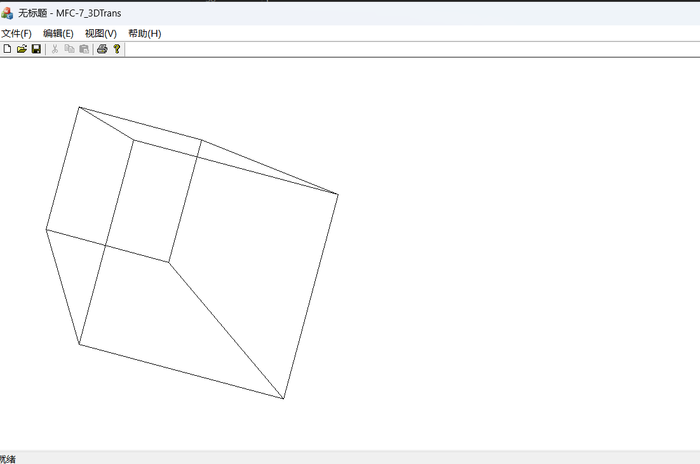

# 实验七：三维几何变换与投影

## 实验目的

1. 理解几何变换的意义
2. 掌握三维基本几何变换的算法
3. 理解投影的意义
4. 掌握透视投影变换算法

## 实验任务

练习三维几何变换和投影变换

## 实验内容

在本次试验中，我们实现透视投影和三维几何变换。我们首先定义一个立方体作为我们要进行变换的三维物体。

### 1. 定义顶点表和面表的数据结构（也可以使用类类型）

定义三维坐标点的结构，面的结构：

```c++
typedef struct POINT3
{
    float x, y, z;
    float c;
}POINT3;

typedef struct EDGE4
{
    int e[4];
}EDGE4;
```
 
### 2. 定义顶点表保存立方体顶点信息

|  顶点   |  $x$ 坐标  |  $y$ 坐标  |  $z$ 坐标  |
|:-----:|:--------:|:--------:|:--------:|
| $V_0$ | $x_0＝-a$ | $y_0＝-a$ | $z_0＝-a$ |
| $V_1$ | $x_1＝a$  | $y_1＝-a$ | $z_1＝-a$ |
| $V_2$ | $x_2＝a$  | $y_2＝a$  | $z_2＝-a$ |
| $V_3$ | $x_3＝-a$ | $y_3＝a$  | $z_3＝-a$ |
| $V_4$ | $x_4＝-a$ | $y_4＝-a$ | $z_4＝a$  |
| $V_5$ | $x_5＝ a$ | $y_5＝-a$ | $z_5＝a$  |
| $V_6$ | $x_6＝ a$ | $y_6＝ a$ | $z_6＝a$  |
| $V_7$ | $x_7＝-a$ | $y_7＝ a$ | $z_7＝a$  |

### 3. 定义面表保存面的信息：

|   面   | 第一个顶点 |  第二个顶点  | 第三个顶点 |  第四个顶点  |   说明    |
|:-----:|:-----:|:-------:|:-----:|:-------:|:-------:|
| $F_0$ |   4   |    5    |   6   |    7    |   前面    |
| $F_1$ |   0   |    3    |   2   |    1    |   后面    |
| $F_2$ |   0   |    4    |   7   |    3    |   左面    |
| $F_3$ |   1   |    2    |   6   |    5    |   右面    |
| $F_4$ |   2   |    3    |   7   |    6    |   顶面    |
| $F_5$ |   0   |    1    |   5   |    4    |   底面    |

立方体参数中的`a=100`，即立方体的边长为200，给出下面代码：

**立方体顶点表的定义代码：**

```c++
PolyDraw3D::PolyDraw3D(float a)
{
    POINT3 points[] = {
        {-a, -a, -a},
        {a, -a, -a},
        {a, a, -a},
        {-a, a, -a},
        {-a, -a, a},
        {a, -a, a},
        {a, a, a},
        {-a, a, a},
    };
}
```

**立方体面表的定义代码：**

```c++
PolyDraw3D::PolyDraw3D()
{
    EDGE4 faces[] = {
        {4, 5, 6, 7}, // front
        {0, 3, 2, 1}, // back
        {0, 4, 7, 3}, // left
        {1, 2, 6, 5}, // right
        {2, 3, 7, 6}, // top
        {0, 1, 5, 4}, // bottom
    };
}
```

## 4. 定义函数实现三维变换的矩阵运算
 
函数代码：

```c++
void PolyDraw3D::matrix_operation(float transform[4][4])
{
    POINT3 pt[8];

    for (int i = 0; i < 8; i++)
    {
        pt[i].x = this->points[i].x * transform[0][0]
                + this->points[i].y * transform[1][0]
                + this->points[i].z * transform[2][0]
                + this->points[i].c * transform[3][0];

        pt[i].y = this->points[i].x * transform[0][1]
                + this->points[i].y * transform[1][1]
                + this->points[i].z * transform[2][1]
                + this->points[i].c * transform[3][1];

        pt[i].z = this->points[i].x * transform[0][2]
                + this->points[i].y * transform[1][2]
                + this->points[i].z * transform[2][2]
                + this->points[i].c * transform[3][2];

        pt[i].c = this->points[i].x * transform[0][3]
                + this->points[i].y * transform[1][3]
                + this->points[i].z * transform[2][3]
                + this->points[i].c * transform[3][3];

        pt[i].x /= pt[i].c;
        pt[i].y /= pt[i].c;
        pt[i].z /= pt[i].c;
        pt[i].c = 1.0f;
    }

    memcpy(this->points, pt, sizeof(pt));
}
```


4. 定义函数实现三维形体的绘制，根据面表和投影变换后的顶点表进行三维形体绘制。
函数代码：
    CPen* pPen = new CPen(PS_SOLID, 1, RGB(0, 0, 0));
    pDC->SelectObject(pPen);
    
    for (int i = 0; i < 6; i++)
    {
        pDC->MoveTo(this->points[this->faces[i].e[0]].x, this->points[this->faces[i].e[0]].y);
        pDC->LineTo(this->points[this->faces[i].e[1]].x, this->points[this->faces[i].e[1]].y);
        pDC->LineTo(this->points[this->faces[i].e[2]].x, this->points[this->faces[i].e[2]].y);
        pDC->LineTo(this->points[this->faces[i].e[3]].x, this->points[this->faces[i].e[3]].y);
        pDC->LineTo(this->points[this->faces[i].e[0]].x, this->points[this->faces[i].e[0]].y);
    }

    pPen->DeleteObject();


## 5. 在`OnDraw()`中实现将立方体围绕 $z$ 轴旋转 $15^\circ$ ，然后沿 $x$ ， $y$ 轴各平移 $(200,200)$ 。最后，做投影中心（视点）在 $(0,0,400)$ ，投影面在 $_XO_Y$ 平面的投影。

**提示：**

- $\sin (15^\circ) = 0.25881904510252$ 
- $\cos (15^\circ) = 0.96592582628907$ 
- 绕 $z$ 轴旋转的变换矩阵：

```math
R_z(\theta)=
\begin{bmatrix}
    \cos \theta & \sin \theta & 0 & 0 \\
    -\sin \theta & \cos \theta & 0 & 0 \\
    0 & 0 & 1 & 0 \\
    0 & 0 & 0 & 1
\end{bmatrix}
```

- 透视变换的矩阵：

    参数 $\theta$ 和 $\varphi$ 的定义如下图所示。 $R$ 是视点到世界坐标原点的距离， $d$ 是视点到投影面的距离。

  

```math
\begin{bmatrix}
    \cos \theta & -\cos \varphi \sin \theta & 0 & \frac{-\sin \varphi \sin \theta}{d} \\
    0 & \sin \varphi & 0 & \frac{-\cos \varphi}{d} \\
    -\sin \theta & -\cos \varphi \cos \theta & 0 & \frac{-\sin \varphi \cos \theta}{d} \\
    0 & 0 & 0 & \frac{R}{d}
\end{bmatrix}
```

**旋转矩阵的定义代码：**

```c++
const float angle_sin = 0.25881904510252;
const float angle_cos = 0.96592582628907;

float matrix[4][4] = {
    {angle_cos, angle_sin, 0, 0},
    {-angle_sin, angle_cos, 0, 0},
    {0, 0, 1, 0},
    {0, 0, 0, 1}
};

```

**平移矩阵的定义代码：**

```c++
void PolyDraw3D::translation(float x, float y, float z)
{
    float matrix[4][4] = {
        {1, 0, 0, 0},
        {0, 1, 0, 0},
        {0, 0, 1, 0},
        {x, y, z, 1}
    };

    this->matrix_operation(matrix);
}
```

**投影矩阵的定义代码：**

```c++
void PolyDraw3D::project_xOy(POINT3 viewer, float screen_distance)
{
    auto distance = [](POINT3 point1, POINT3 point2 = POINT3{0, 0, 0}) -> float
    {
        float dx = point2.x - point1.x;
        float dy = point2.y - point1.y;
        float dz = point2.z - point1.z;
        return sqrt(dx * dx + dy * dy + dz * dz);
    };
    
    float origin_distance = distance(viewer);

    float phi_sin = distance(POINT3{0, viewer.y, 0}, viewer) / origin_distance;
    float phi_cos = viewer.y / origin_distance;

    float theta_sin = viewer.x / distance(POINT3{viewer.x, 0, viewer.z});
    float theta_cos = viewer.z / distance(POINT3{viewer.x, 0, viewer.z});

    float matrix[4][4] = {
        {theta_cos, -phi_cos * theta_sin, 0, -phi_sin * theta_sin / screen_distance},
        {0, phi_sin, 0, -phi_cos / screen_distance},
        {-theta_sin, -phi_cos * theta_cos, 0, -phi_sin * theta_cos / screen_distance},
        {0, 0, 0, origin_distance / screen_distance}
    };

    this->matrix_operation(matrix);
}
```

**完成全部变换并绘制结果的代码：**

```c++
#include "stdafx.h"
#include "3DPolyDraw.h"
#include <cmath>

PolyDraw3D::PolyDraw3D(float a)
{
    POINT3 points[] = {
        {-a, -a, -a},
        {a, -a, -a},
        {a, a, -a},
        {-a, a, -a},
        {-a, -a, a},
        {a, -a, a},
        {a, a, a},
        {-a, a, a},
    };

    EDGE4 faces[] = {
        {4, 5, 6, 7}, // front
        {0, 3, 2, 1}, // back
        {0, 4, 7, 3}, // left
        {1, 2, 6, 5}, // right
        {2, 3, 7, 6}, // top
        {0, 1, 5, 4}, // bottom
    };


    memcpy(this->points, points, sizeof(points));
    memcpy(this->faces, faces, sizeof(faces));
}

void PolyDraw3D::OnDraw(CDC* pDC)
{
    this->rotation_z();
    this->translation(200.0f, 200.0f, 0.0f);
    this->project_xOy(POINT3{0, 0, 400}, 500.0f);

    CPen* pPen = new CPen(PS_SOLID, 1, RGB(0, 0, 0));
    pDC->SelectObject(pPen);
    
    for (int i = 0; i < 6; i++)
    {
        pDC->MoveTo(this->points[this->faces[i].e[0]].x, this->points[this->faces[i].e[0]].y);
        pDC->LineTo(this->points[this->faces[i].e[1]].x, this->points[this->faces[i].e[1]].y);
        pDC->LineTo(this->points[this->faces[i].e[2]].x, this->points[this->faces[i].e[2]].y);
        pDC->LineTo(this->points[this->faces[i].e[3]].x, this->points[this->faces[i].e[3]].y);
        pDC->LineTo(this->points[this->faces[i].e[0]].x, this->points[this->faces[i].e[0]].y);
    }

    pPen->DeleteObject();
}

void PolyDraw3D::matrix_operation(float transform[4][4])
{
    POINT3 pt[8];

    for (int i = 0; i < 8; i++)
    {
        pt[i].x = this->points[i].x * transform[0][0]
                + this->points[i].y * transform[1][0]
                + this->points[i].z * transform[2][0]
                + this->points[i].c * transform[3][0];

        pt[i].y = this->points[i].x * transform[0][1]
                + this->points[i].y * transform[1][1]
                + this->points[i].z * transform[2][1]
                + this->points[i].c * transform[3][1];

        pt[i].z = this->points[i].x * transform[0][2]
                + this->points[i].y * transform[1][2]
                + this->points[i].z * transform[2][2]
                + this->points[i].c * transform[3][2];

        pt[i].c = this->points[i].x * transform[0][3]
                + this->points[i].y * transform[1][3]
                + this->points[i].z * transform[2][3]
                + this->points[i].c * transform[3][3];

        pt[i].x /= pt[i].c;
        pt[i].y /= pt[i].c;
        pt[i].z /= pt[i].c;
        pt[i].c = 1.0f;
    }

    memcpy(this->points, pt, sizeof(pt));
}

void PolyDraw3D::rotation_z()
{
    const float angle_sin = 0.25881904510252;
    const float angle_cos = 0.96592582628907;
    
    float matrix[4][4] = {
        {angle_cos, angle_sin, 0, 0},
        {-angle_sin, angle_cos, 0, 0},
        {0, 0, 1, 0},
        {0, 0, 0, 1}
    };

    this->matrix_operation(matrix);
}

void PolyDraw3D::translation(float x, float y, float z)
{
    float matrix[4][4] = {
        {1, 0, 0, 0},
        {0, 1, 0, 0},
        {0, 0, 1, 0},
        {x, y, z, 1}
    };

    this->matrix_operation(matrix);
}

void PolyDraw3D::project_xOy(POINT3 viewer, float screen_distance)
{
    auto distance = [](POINT3 point1, POINT3 point2 = POINT3{0, 0, 0}) -> float
    {
        float dx = point2.x - point1.x;
        float dy = point2.y - point1.y;
        float dz = point2.z - point1.z;
        return sqrt(dx * dx + dy * dy + dz * dz);
    };
    
    float origin_distance = distance(viewer);

    float phi_sin = distance(POINT3{0, viewer.y, 0}, viewer) / origin_distance;
    float phi_cos = viewer.y / origin_distance;

    float theta_sin = viewer.x / distance(POINT3{viewer.x, 0, viewer.z});
    float theta_cos = viewer.z / distance(POINT3{viewer.x, 0, viewer.z});

    float matrix[4][4] = {
        {theta_cos, -phi_cos * theta_sin, 0, -phi_sin * theta_sin / screen_distance},
        {0, phi_sin, 0, -phi_cos / screen_distance},
        {-theta_sin, -phi_cos * theta_cos, 0, -phi_sin * theta_cos / screen_distance},
        {0, 0, 0, origin_distance / screen_distance}
    };

    this->matrix_operation(matrix);
}
```



## 小结

理解了几何变换、投影的意义，并掌握三维基本几何变换的算法与透视投影变换算法。
