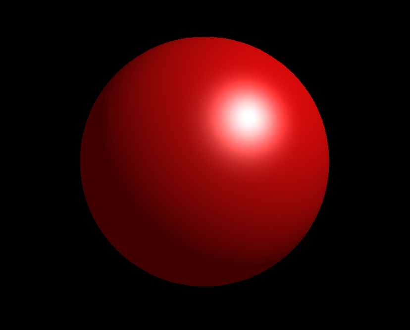

# 实验八：简单光照模型

## 实验目的

1. 了解简单光照明模型的基本原理，实现物体的真实感图形显示效果。
2. 掌握光照模型的计算
3. 掌握光滑着色模型的计算

## 实验任务

练习简单光照模型。

## 算法原理

### 1. 简单光照模型

Phong光照模型认为物体表面一点反射的光强由三部分组成：

- 环境光（Ambient）：场景中的其他间接光照；
- 漫反射（Diffuse）：散射部分（大但不光亮）；
- 高光反射（Specular）：镜面反射部分（小而亮）。

$$
I = I_e + I_d + I_s
$$

其中， $I$ 表示物体表面上一点反射到视点的光强（Intensity）； $I_e$ 表示环境光光强； $I_d$ 表示漫反射光光强；
$I_s$ 表示镜面反射光光强。

在光照计算中要结合光源强度和物体材质：

- 材质对环境光的反射率 $k_a$ 与环境光分量 $I_a$ 相结合；
- 对漫反射光的反射率 $k_d$ 与光源的漫反射光分量 $I_d$ 相结合；
- 对镜面反射光的反射率 $k_s$ 与光源的镜面反射光分量 $I_s$ 相结合。

考虑环境光、漫反射光和镜面反射光且只有一个点光源的简单光照模型为:

$$
\begin{align*}
   I & = I_e + I_d + I_s \\
     & = k_a I_a + k_d I_p \mathrm{max}(L \cdot N, 0) + k_s I_p \mathrm{max}(H \cdot N, 0)^n
\end{align*}
$$

### 2. 着色模型——Gouraud着色模型

首先在多边形网格的每个顶点上使用光照模型计算出颜色，然后插值计算多边形内部的颜色。


## 实验内容

1. 本实验已经提供大部分的程序代码，请打开实验8项目仔细阅读并理解程序结构。
2. 打开`Lighting.cpp`文件，其中的光照模型计算的函数如下，补全其中的第1步、第2步、第4步的代码，并将成功运行的截图粘贴在
下方：

    ```c++
    CRGB CLighting::Lighting(CP3 ViewPoint,CP3 Point,CVector Normal,CMaterial *pMaterial)
    {	
        CRGB LastC=pMaterial->M_Emit;//材质自身发散色为初始值	
        for(int i=0;i<LightNum;i++)//来自光源
        {	
            if(Light[i].L_OnOff)
            {		
                CRGB InitC;
                InitC.red=0,InitC.green=0,InitC.blue=0;
                CVector VL(Point,Light[i].L_Position);//指向光源的矢量
                double d=VL.Mag();//光传播的距离，等于矢量VL的模
                VL=VL.Normalize();//光矢量单位化
                CVector VN=Normal;
                VN=VN.Normalize();//法矢量单位化			
                double CosTheta=Dot(VL,VN);
                if(CosTheta>=0.0)//光线可以照射到物体
                {
                    //第1步，加入漫反射光
                    
                    InitC.red += Light[i].L_Diffuse.red * pMaterial->M_Diffuse.red * CosTheta;
                    InitC.green += Light[i].L_Diffuse.green * pMaterial->M_Diffuse.green * CosTheta;
                    InitC.blue += Light[i].L_Diffuse.blue * pMaterial->M_Diffuse.blue * CosTheta;
                    
                    //第2步，加入镜面反射光
                    CVector VV(Point,ViewPoint);
                    VV=VV.Normalize();
                    
                    CVector VH=(VL+VV)/(VL+VV).Mag();
                    
                    double nHN=pow(MAX(Dot(VH,VN),0),pMaterial->M_n);
                    
                    InitC.red += Light[i].L_Specular.red * pMaterial->M_Specular.red * nHN;
                    InitC.green += Light[i].L_Specular.green * pMaterial->M_Specular.green * nHN;
                    InitC.blue += Light[i].L_Specular.blue * pMaterial->M_Specular.blue * nHN;				
                }
                //第3步，光强衰减
                double c0=Light[i].L_C0;
                double c1=Light[i].L_C1;
                double c2=Light[i].L_C2;			
                double f=(1.0/(c0+c1*d+c2*d*d));//二次衰减函数
                f=MIN(1.0,f);		
                LastC+=InitC*f;		
            }
            else
            {
                LastC=Point.c;
            }		
        }
        //第4步，加入环境光
    
        LastC += Ambient * pMaterial->M_Ambient;
        
        //第5步，颜色归一到[0,1]区间
        LastC.Normalize();		
        //第6步，返回所计算顶点的光强颜色
        return LastC;
    }	
    ```
   
    

## 小结

了解简单光照明模型的基本原理，并掌握了光照模型与光滑着色模型的计算。


