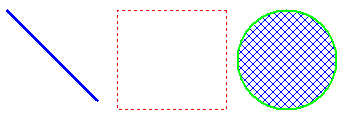
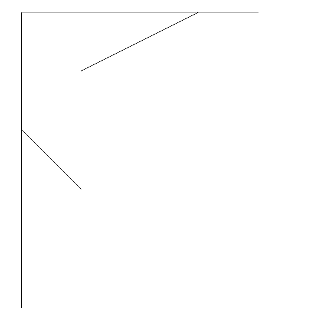
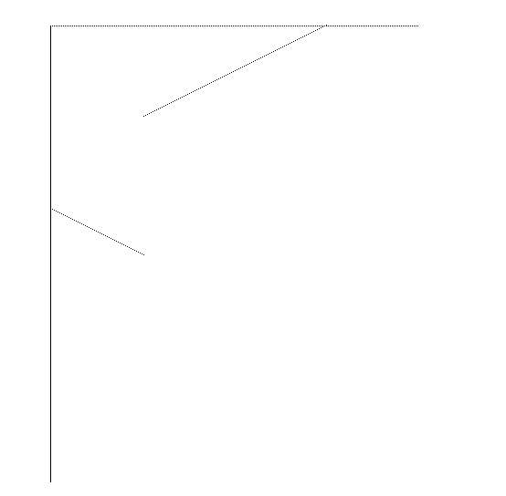
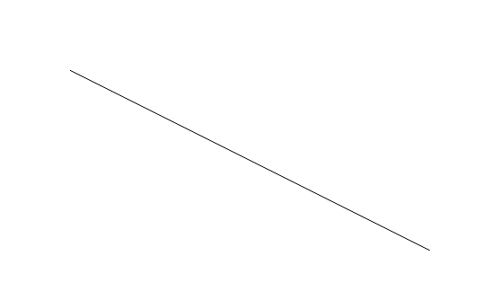
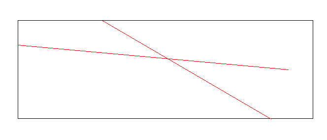
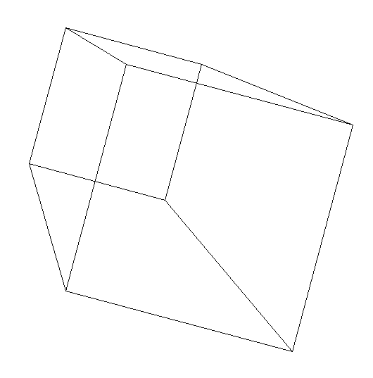

# MFC_ComputerGraph

> [!TIP]
> 
> For English see the [second half part](#mfc_computergraph-1).

基于MFC的计算机图形学实践作业。

包含下列内容：

| 项目名称                      |                                           位置                                           | 备注                          |                              结果                              |
|:--------------------------|:--------------------------------------------------------------------------------------:|:----------------------------|:------------------------------------------------------------:|
| `MFC-1.vcxproj`           |                [`/1_MFCBasic/MFC-1/MFC-1.vcxproj`](./1_MFCBasic/MFC-1/)                | MFC绘图基础                     |                           |
| `MFC-2_Bres.vcxproj`      |        [`/1_MFCBasic/MFC-2_Bres/MFC-2_Bres.vcxproj`](./1_MFCBasic/MFC-2_Bres/)         | 直线绘制算法：Bresenham算法          |                     |
| `MFC-2_DDA.vcxproj`       |          [`/1_MFCBasic/MFC-2_DDA/MFC-2_DDA.vcxproj`](./1_MFCBasic/MFC-2_DDA/)          | 直线绘制算法：DDA算法                |                            |
| `MFC-3_Bresenham.vcxproj` | [`/1_MFCBasic/MFC-3_Bresenham/MFC-3_Bresenham.vcxproj`](./1_MFCBasic/MFC-3_Bresenham/) | 圆绘制算法：Bresenham扫描算法         |                     |
| `MFC-3_Wu.vcxproj`        |           [`/1_MFCBasic/MFC-3_Wu/MFC-3_Wu.vcxproj`](./1_MFCBasic/MFC-3_Wu/)            | 直线绘制算法：Wu反走样算法              |                              |
| `MFC-4_PolyFill.vcxproj`  |  [`/1_MFCBasic/MFC-4_PolyFill/MFC-4_PolyFill.vcxproj`](./1_MFCBasic/MFC-4_PolyFill/)   | 多边形填充算法：边标志边缘填充算法           |            |
| `MFC-5_SeedFill.vcxproj`  |  [`/1_MFCBasic/MFC-5_SeedFill/MFC-5_SeedFill.vcxproj`](./1_MFCBasic/MFC-5_SeedFill/)   | 多边形填充算法：种子填充算法              |                 |
| `MFC-6_CorhenSu.vcxproj`  |  [`/1_MFCBasic/MFC-6_CorhenSu/MFC-6_CorhenSu.vcxproj`](./1_MFCBasic/MFC-6_CorhenSu/)   | 剪裁算法：Cohen Sutherland直线剪裁算法 |           |
| `MFC-7_3DTrans.vcxproj`   |    [`/1_MFCBasic/MFC-7_3DTrans/MFC-7_3DTrans.vcxproj`](./1_MFCBasic/MFC-7_3DTrans/)    | 三维变换算法：几何变换与投影算法            |  |

## 构建项目

由于MFC仅支持Windows，因此必须在Windows系统上调试、运行。

本项目仅在Visual Studio 2022中测试。为兼容Visual Studio 2008，已将预编译头更改为`stdafx.h`，但因为解决方案使用Visual 
Studio 2022新建，所以欲想在Visual Studio 2008中运行，需要自行新建解决方案和项目，并将代码文件拷贝到新建的项目中。考虑到
Visual Studio 2008已停止支持，不对Visual Studio 2008作出任何支持或承诺。

### 安装依赖

预想构建本项目，必须安装本机架构的“适用于最新v143生成工具的C++ MFC”与“使用C++的桌面开发”的工作负载。

- 打开Visual Studio Installer；
- 如果还没有安装Visual Studio 2022，在“可用”中点击“安装”。如果已经安装，则在“已安装”中选择“修改”；
- 在“桌面应用和移动应用”中，选择“使用C++的桌面开发”；
- 在右侧“安装详细信息”中勾选“适用于最新v143生成工具的C++ MFC”的可选组件，或在单个组件中选择该项；
- 点击“修改”或“安装”。

### 运行项目

预想运行项目，需要正确设置启动项目：

- 将项目拷贝到本地。除了在仓库页面下载，也可以使用`git clone`；
- 使用Visual Studio 2022打开解决方案`/1_MFCBasic/MFC_Basic.sln`；
- 打开“解决方案资源管理器”，右键想要运行的项目，选择“设为启动项目”；
- 按下`F5`或在菜单栏中选择“调试-开始调试”。

除此之外，推荐使用Jetbrains Rider，该IDE可以很方便地管理、运行项目：

- 确保正确安装Visual Studio及依赖；
- 使用Rider打开解决方案`/1_MFCBasic/MFC_Basic.sln`；
- 在右上角选择运行配置；
- 按下配置旁边的“调试”。

## 贡献项目

该项目仅作为本人的课程作业，因此不考虑任何形式的贡献。

## 开源许可

该项目遵循MIT开源许可。

-------------

# MFC_ComputerGraph

Computer Graphics Practice Assignment Based on MFC

This repository includes the following projects:

| Project Name              |                                        Location                                        | Description                                |                            Output                           |
| :------------------------ | :------------------------------------------------------------------------------------: | :----------------------------------------- | :---------------------------------------------------------: |
| `MFC-1.vcxproj`           |                [`/1_MFCBasic/MFC-1/MFC-1.vcxproj`](./1_MFCBasic/MFC-1/)                | Basic MFC Drawing                          |                          |
| `MFC-2_Bres.vcxproj`      |         [`/1_MFCBasic/MFC-2_Bres/MFC-2_Bres.vcxproj`](./1_MFCBasic/MFC-2_Bres/)        | Line Drawing Algorithm: Bresenham          |                    |
| `MFC-2_DDA.vcxproj`       |          [`/1_MFCBasic/MFC-2_DDA/MFC-2_DDA.vcxproj`](./1_MFCBasic/MFC-2_DDA/)          | Line Drawing Algorithm: DDA                |                           |
| `MFC-3_Bresenham.vcxproj` | [`/1_MFCBasic/MFC-3_Bresenham/MFC-3_Bresenham.vcxproj`](./1_MFCBasic/MFC-3_Bresenham/) | Circle Drawing Algorithm: Bresenham Scan   |                    |
| `MFC-3_Wu.vcxproj`        |            [`/1_MFCBasic/MFC-3_Wu/MFC-3_Wu.vcxproj`](./1_MFCBasic/MFC-3_Wu/)           | Line Drawing Algorithm: Wu Antialiasing    |                             |
| `MFC-4_PolyFill.vcxproj`  |   [`/1_MFCBasic/MFC-4_PolyFill/MFC-4_PolyFill.vcxproj`](./1_MFCBasic/MFC-4_PolyFill/)  | Polygon Fill Algorithm: Edge Flag Fill     |           |
| `MFC-5_SeedFill.vcxproj`  |   [`/1_MFCBasic/MFC-5_SeedFill/MFC-5_SeedFill.vcxproj`](./1_MFCBasic/MFC-5_SeedFill/)  | Polygon Fill Algorithm: Seed Fill          |                |
| `MFC-6_CorhenSu.vcxproj`  |   [`/1_MFCBasic/MFC-6_CorhenSu/MFC-6_CorhenSu.vcxproj`](./1_MFCBasic/MFC-6_CorhenSu/)  | Clipping Algorithm: Cohen–Sutherland       |          |
| `MFC-7_3DTrans.vcxproj`   |    [`/1_MFCBasic/MFC-7_3DTrans/MFC-7_3DTrans.vcxproj`](./1_MFCBasic/MFC-7_3DTrans/)    | 3D Transformation: Geometry and Projection |  |

## Building the Projects

Since MFC is supported only on Windows, the projects must be run and debugged on a Windows system.

These projects were tested using Visual Studio 2022 only. Although the precompiled header was changed to `stdafx.h` to 
allow potential compatibility with Visual Studio 2008, the solution was created using Visual Studio 2022. To use it in 
Visual Studio 2008, you’ll need to create new projects manually and copy the source files. Since Visual Studio 2008 is 
no longer supported, no effort will be made to ensure compatibility with it.

### Installing Dependencies

To build this project, you must install the following workloads for your system architecture with **C++ MFC for v143 
build tools** and **Desktop development with C++**.

Steps:

- Open **Visual Studio Installer**; 
- If Visual Studio 2022 is not installed, click “Install” under “Available”. If it is already installed, click “Modify” under “Installed”; 
- In the “Desktop & Mobile” category, select **Desktop development with C++**; 
- On the right panel, check the optional component **C++ MFC for latest v143 build tools**, or select it under “Individual components”; 
- Click **Modify** or **Install**.

### Running the Projects

To run the projects:

1. Clone the repository or download the files;
2. Open the solution file `/1_MFCBasic/MFC_Basic.sln` in Visual Studio 2022;
3. In **Solution Explorer**, right-click on the desired project and select **Set as Startup Project**;
4. Press `F5` or choose **Debug - Start Debugging** from the menu.

Alternatively, JetBrains Rider is also recommended for easily managing and running the projects:

1. Ensure Visual Studio and its dependencies are properly installed;
2. Open the solution `/1_MFCBasic/MFC_Basic.sln` in Rider;
3. Choose a run configuration from the top-right dropdown;
4. Click the **Debug** button next to it.

## Contributing

This project was created solely as a personal course assignment and is not accepting any contributions.

## License

This project is licensed under the MIT License.

